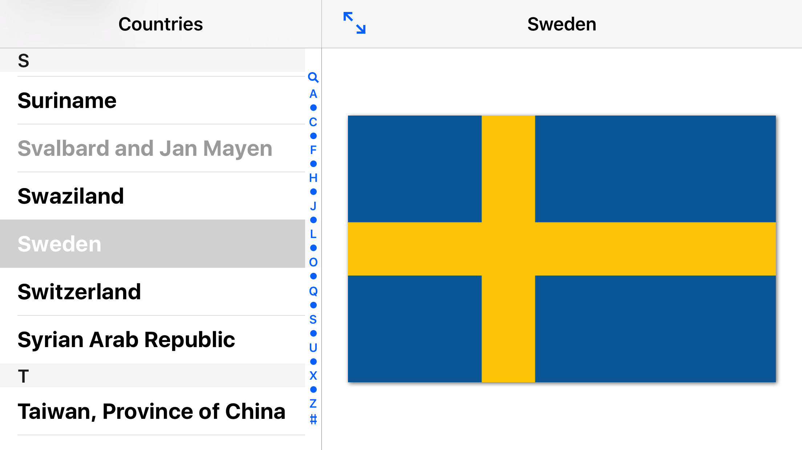
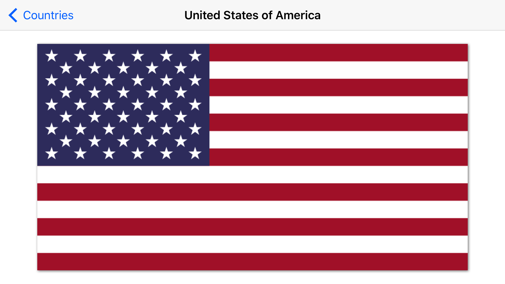

# Flags

Flags is a simple app for browsing all the countries of the world and their flags.

## Features

- Browse and view flags in landscape mode.
- Tap on a flag to hide country name (great for memory games).
- Navigate quickly by swiping between countries.
- Shake your phone to show a random country.
- Full-text search in the list of countries.

## Screenshots

